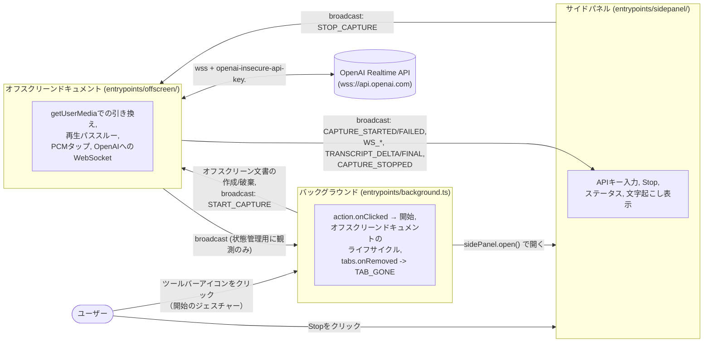
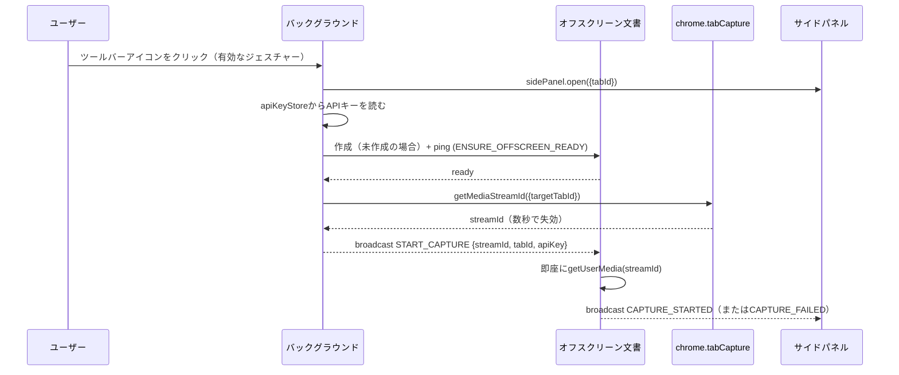
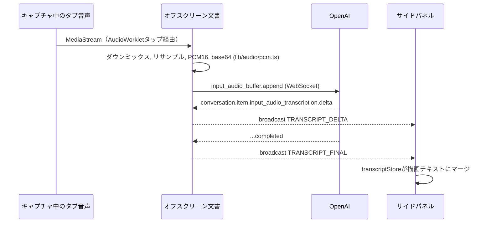

# Koemieru MVP: 設計

Issue: [#1](https://github.com/satoryu/koemieru/issues/1) · 要件: [requirements.md](requirements.md)

## Architecture Overview（アーキテクチャ概要）

3つの拡張機能コンテキストを、`chrome.offscreen`ドキュメントのライフサイクルとキャプチャセッションの状態管理を一手に引き受けるバックグラウンドサービスワーカーを中心に連携させる。サイドパネルとオフスクリーンドキュメントは直接メッセージをやり取りしない — `browser.runtime.sendMessage`/`onMessage`でブロードキャストし、各コンテキストは自分が扱うべきメッセージ種別に反応しつつ、状態管理に必要な他のメッセージは受動的に観測する（[protocol.ts](../../lib/messaging/protocol.ts)参照）。

> **重要な設計変更（実装中に判明）**: 当初はサイドパネル内の「Start」ボタンから`chrome.tabCapture.getMediaStreamId()`を呼ぶ設計だったが、実機検証で`Extension has not been invoked for the current page (see activeTab permission)`エラーに遭遇した。調査の結果、これはChromiumチーム自身が公式に説明している意図的な仕様で、サイドパネルは常時表示されうるサーフェスであるという理由から`activeTab`の付与対象から除外されており、パネル内のボタンクリックでは`tabCapture`を開始できない（該当のChromiumバグ報告はWon't Fixでクローズ済み: [crbug/40926394](https://issues.chromium.org/issues/40926394)）。そのため、**Startのトリガーをツールバーアイコンのクリックに変更**した。`browser.action.onClicked`ハンドラ内でストリームIDの取得とサイドパネルを開く処理を同じジェスチャー内で行う。サイドパネルの「Start」ボタンは廃止し、案内テキストに置き換えた。「Stop」ボタンはこの制約を受けない（停止に`activeTab`は不要）ため、そのままサイドパネル内に残している。



## Component Design（コンポーネント設計）

### サイドパネル (`entrypoints/sidepanel/`)

UIの状態（`idle | active`）を保持し、文字起こしの状態を描画する。**Startボタンは持たない**（下記の設計変更を参照）。APIキー入力（`lib/storage/apiKeyStore.ts`経由で永続化）とStopボタンのみを持ち、Stopクリックで`STOP_CAPTURE`をブロードキャストする。`CAPTURE_STARTED`/`CAPTURE_FAILED`/`WS_*`/`TRANSCRIPT_DELTA`/`TRANSCRIPT_FINAL`/`CAPTURE_STOPPED`/`TAB_GONE`を受信してステータス表示と文字起こし描画を更新する。

### バックグラウンド (`entrypoints/background.ts`)

- `browser.action.onClicked`を購読する。クリックされたタブに対して`browser.sidePanel.open({tabId})`でサイドパネルを開き、同じジェスチャー内で（`capturedTabId`が未設定なら）`lib/storage/apiKeyStore.ts`からAPIキーを読み、オフスクリーンドキュメントを準備し、`chrome.tabCapture.getMediaStreamId({targetTabId})`を呼んでストリームIDを取得し、`START_CAPTURE`をブロードキャストする。（`setPanelBehavior({openPanelOnActionClick: true})`は**使わない** — それは`action.onClicked`の発火自体を止めてしまうため。）
- `ENSURE_OFFSCREEN_READY`を処理: オフスクリーンドキュメントが存在しなければ作成する（`reasons: ['USER_MEDIA']`。`AUDIO_PLAYBACK`は無音状態が30秒続くと自動的にドキュメントを閉じてしまい、静かな間があるだけでセッションが落ちてしまうため使わない）。作成後、`createDocument()`の解決がドキュメント側のメッセージリスナー登録を保証しないため、短いリトライ付きのping/pongでレディを確認する。
- `CAPTURE_FAILED`/`CAPTURE_STOPPED`のブロードキャストを受動的に観測し、`capturedTabId`をクリアするとともにオフスクリーンドキュメントを閉じる（常駐させ続けるより単純さを優先。次回のクリックでその都度作り直す）。
- `chrome.tabs.onRemoved`: 削除されたタブがキャプチャ対象だった場合、`TAB_GONE`と`STOP_CAPTURE`をブロードキャストする。

### オフスクリーンドキュメント (`entrypoints/offscreen/`)

表示UIは持たない — `getUserMedia`・`AudioContext`・長時間生存する`WebSocket`にはDOM APIが必要で、バックグラウンドサービスワーカーにはそれがなく、生存も保証されないために存在する。

1. `getUserMedia({audio: {mandatory: {chromeMediaSource:'tab', chromeMediaSourceId: streamId}}})` → `MediaStream`を取得。
2. 再生パススルー: `new AudioContext()` → `createMediaStreamSource(stream)` → `.connect(ctx.destination)` — キャプチャされたタブはデフォルトで無音になるため、可聴性を復元する。
3. 処理用タップ（タブキャプチャ単体の動作確認後に追加）: 同じsourceから分岐した`AudioWorkletNode`がFloat32フレームを`main.ts`へ送り返す。
4. `lib/audio/pcm.ts`による変換: ダウンミックス → 48kHz→24kHzへのリサンプル → Float32→Int16 → base64エンコード。
5. `wss://api.openai.com/v1/realtime?model=<model>`へ、サブプロトコル`["realtime", "openai-insecure-api-key." + apiKey]`でWebSocket接続。文字起こしセッションの設定を送信した後、`input_audio_buffer.append`でチャンクをストリーミングする。
6. `conversation.item.input_audio_transcription.delta`/`...completed`イベントを`TRANSCRIPT_DELTA`/`TRANSCRIPT_FINAL`のブロードキャストにルーティングする（正確なイベント名は実装直前にOpenAIの公式ドキュメントで再検証する）。
7. 自動再接続は行わない：`onclose`/`onerror` → `WS_CLOSED`/`WS_ERROR`、リソースを完全にクリーンアップし、明確なエラーをユーザーに表示する。

### 共有`lib/`モジュール

| モジュール | 役割 | 切り出す理由 |
|---|---|---|
| `lib/audio/pcm.ts` | ダウンミックス、リサンプル、Float32→Int16、base64エンコード | 純粋関数でchrome APIへの依存がなく、微妙なミスをしやすい — 単体テストの価値が最も高い |
| `lib/transcript/transcriptStore.ts` | delta/finalイベントを重複のない描画可能な文字起こし状態にマージする | 「重複させない」という受け入れ基準を直接テストできる |
| `lib/storage/apiKeyStore.ts` | `chrome.storage.local`の薄いラッパー | `wxt/testing/fake-browser`でテスト可能。`sync`ではなく意図的に`local`を使用 |
| `lib/messaging/protocol.ts` | 判別可能なユニオン型のメッセージ定義とガード関数 | 個別にバンドルされる3つのエントリポイント間でのメッセージ形状のズレを防ぐ |
| `lib/openai/realtimeSession.ts` | WebSocketのURL/サブプロトコル/ペイロードを組み立て、`onDelta`/`onFinal`/`onError`/`onClose`を公開する | フェイクのWebSocketに対してWebSocketプロトコル部分を単体テストできる |

それ以外（AudioContextのグラフ配線、`chrome.offscreen`呼び出し、DOM更新）はCLAUDE.mdの「先回りして再構成しない」方針に従い、各エントリポイント内にインラインで残す。

## Data Flow（データフロー）

### 開始シーケンス（ユーザー操作の資格とストリームID失効との競合）

`chrome.tabCapture.getMediaStreamId()`は、Chromeが「拡張機能が呼び出された」と認める操作（ツールバーアイコンのクリック・右クリックメニュー・キーボードショートカット・アドレスバー候補選択のいずれか）の最中でなければ失敗する。サイドパネルは常時表示されうるサーフェスであるため、**サイドパネルが開いていること自体、およびパネル内のボタンクリックは、この資格に含まれない**（Chromiumチームが意図的にそう設計しており、該当のバグ報告はWon't Fixでクローズされている）。そのため開始処理はすべて`browser.action.onClicked`ハンドラの中で完結させる。加えて、`getMediaStreamId()`が返すIDは一度しか使えず数秒で失効するため、この一連の処理を素早く行う必要がある：



### 文字起こしフロー（定常状態）



## Domain Models（ドメインモデル）

```ts
// lib/messaging/protocol.ts（実装済み）
type CaptureFailureReason = 'PERMISSION_DENIED' | 'STREAM_ID_EXPIRED' | 'UNKNOWN';

type KoemieruMessage =
  | { type: 'ENSURE_OFFSCREEN_READY' }
  | { type: 'START_CAPTURE'; streamId: string; tabId: number; apiKey: string }
  | { type: 'CAPTURE_STARTED' }
  | { type: 'CAPTURE_FAILED'; reason: CaptureFailureReason; detail?: string }
  | { type: 'WS_CONNECTING' | 'WS_OPEN' }
  | { type: 'WS_CLOSED' | 'WS_ERROR'; code?: number; reason?: string }
  | { type: 'TRANSCRIPT_DELTA'; itemId: string; delta: string }
  | { type: 'TRANSCRIPT_FINAL'; itemId: string; transcript: string }
  | { type: 'STOP_CAPTURE' }
  | { type: 'CAPTURE_STOPPED' }
  | { type: 'TAB_GONE'; tabId: number };
```

`lib/transcript/transcriptStore.ts`の状態モデル（文字起こしタスクで実装予定）: 確定済みセグメントの順序付きリストと、`itemId`をキーとする進行中セグメント1つを保持する。`delta`は進行中セグメントを更新し、対応する`final`が届くと到着順に関わらず一度だけ確定テキストに置き換わり、重複しない。

## Known Risks（既知のリスク、requirements.mdのConstraintsも参照）

- 生のAPIキーによるWebSocket認証経路はOpenAI公式ドキュメントでは未検証。既知のリスクとして受け入れており、フォールバックとして最小限のエフェメラルトークン発行バックエンドを想定している。
- OpenAIの文字起こしセッション設定JSONおよびイベントのフィールド名は、このドキュメントの記述をそのまま信用せず、実装直前に`developers.openai.com`で再検証する。
