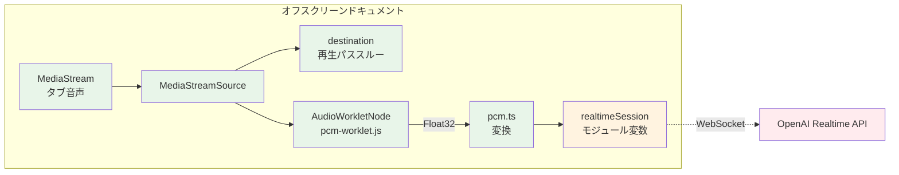
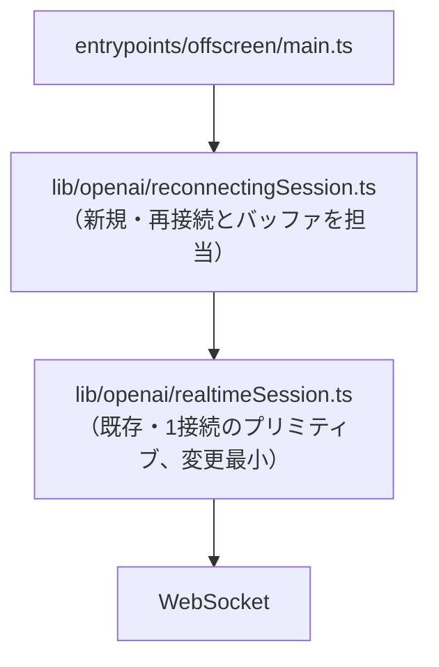
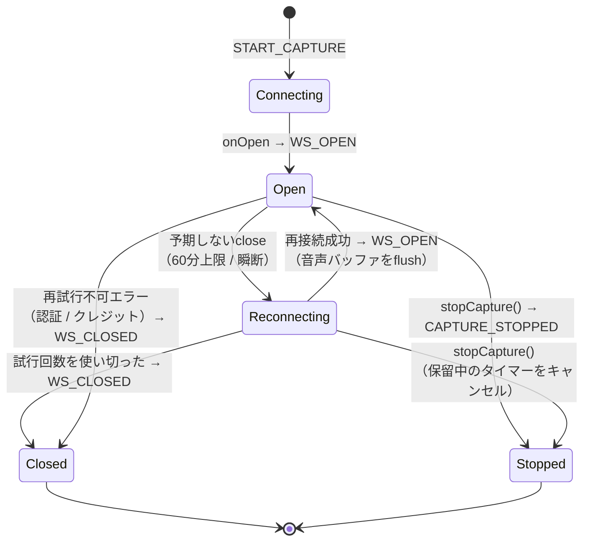
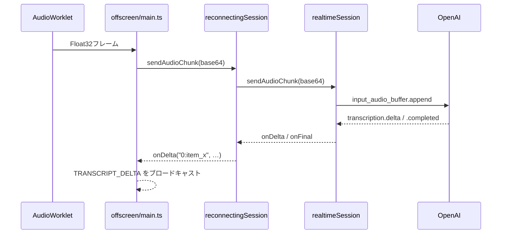
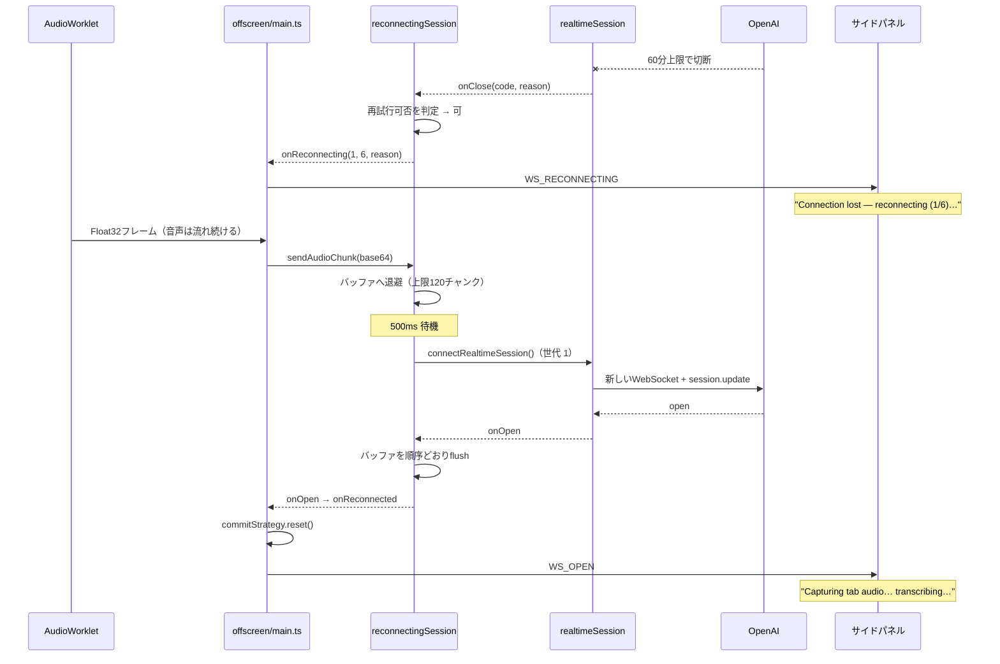

# OpenAI Realtimeセッションの自動再接続: 設計

Issue: [#2](https://github.com/satoryu/koemieru/issues/2) · 要件: [requirements.md](requirements.md) · タスク: [tasks.md](tasks.md)

## Architecture Overview

[MVPの設計](../1-koemieru-mvp/design.md)から、拡張機能の3コンテキスト構成（サイドパネル / バックグラウンド / オフスクリーンドキュメント）は変更しない。変更はオフスクリーンドキュメントの内側に閉じる。

鍵になるのは、**音声パイプラインとOpenAIへのWebSocketがもともと独立している**という既存構造である。



緑の部分（音声側）は接続断とまったく無関係に動き続けられる。橙の`realtimeSession`だけを差し替えれば、文字起こしは何事もなかったかのように継続する。

現状の問題は、`entrypoints/offscreen/main.ts`の`onClose`ハンドラが**切断理由を問わず`teardownAudioResources()`を呼び、緑の部分まで巻き添えで落としている**ことにある。

## Component Design

### 再接続ロジックの置き場所

`lib/openai/realtimeSession.ts`の`connectRealtimeSession()`は「1本のWebSocketを張って、そのイベントを`onDelta`/`onFinal`等にルーティングする」プリミティブとして完成しており、フェイクWebSocketに対するテストが揃っている。**これは変更せず**、その上に薄いラッパーを新設する。

**`lib/openai/reconnectingSession.ts`（新規）** — `connectRealtimeSession()`を内部で呼び直すことで、既存の`RealtimeSession`インターフェース（`sendAudioChunk` / `commit` / `close`）を保ったまま自己修復する。

この置き方を選ぶ理由:

- `connectRealtimeSession()`がすでに持つ`WebSocketFactory`という差し込み口をそのまま再利用でき、フェイクWebSocket + `vi.useFakeTimers()`でバックオフ・音声バッファ・再試行可否の判定をすべてユニットテストできる（NFR-2）。
- 呼び出し側（`entrypoints/offscreen/main.ts`）はハンドラが増えるだけで済み、`realtimeSession`変数を差し替える必要がない。結果として「古い接続の`onClose`が、すでに張り直された新しい接続を巻き込んで落とす」という世代管理のバグを構造的に作り込まずに済む。
- `entrypoints/background.ts`は一切変更不要になる（後述）。



### 責務の分割

| モジュール | 責務 |
|---|---|
| `lib/openai/realtimeSession.ts` | 1本のWebSocketの確立、ペイロード生成、イベントのルーティング。**再接続のことは知らない** |
| `lib/openai/reconnectingSession.ts` | 切断の検知、再試行可否の判定、バックオフ、音声バッファ、接続世代の管理 |
| `entrypoints/offscreen/main.ts` | 音声パイプラインの構築・破棄、メッセージのブロードキャスト |
| `entrypoints/background.ts` | セッションの記録とオフスクリーンドキュメントのライフサイクル（**変更なし**） |
| `entrypoints/sidepanel/main.ts` | ステータス表示 |

### 状態遷移

`WS_CLOSED`の意味を「WebSocketが閉じた」から「**再接続を諦めた／再試行不可だった、つまりセッション終了**」に格上げする。これにより`entrypoints/background.ts`の「`WS_CLOSED`を受けたらオフスクリーンドキュメントを閉じる」という既存処理は**そのままで正しいまま**になる（NFR-3）。再接続中はオフスクリーンドキュメントが閉じられてはならないが、新設する`WS_RECONNECTING`はbackgroundの`switch`の`default`に落ちるため何も起きない。



### 再試行可否の判定

判定材料を得るため、`lib/openai/realtimeSession.ts`の`onServerError`の引数を拡張する（現状はメッセージ文字列のみだが、`parseRealtimeEvent`はすでに`error.code`と`error.type`をパースしている）。

```ts
onServerError?: (message: string, code?: string, errorType?: string) => void;
```

OpenAIは60分上限到達時のエラーコードを公式ドキュメント化していない（C-2）。したがって「期限切れらしいコードなら再接続する」という許可リスト方式は取れない。代わりに**再試行不可の deny-list**を置き、それ以外はすべて再試行する:

| コード / タイプ | 理由 |
|---|---|
| `invalid_api_key` | キーが間違っている。何度試しても通らない |
| `insufficient_quota` | クレジット切れ。ユーザーが課金するまで回復しない |
| `credit_balance_exhausted` | 同上 |
| `invalid_model` | 設定の誤り。再試行しても同じ結果になる |

deny-listに載せ漏れた設定エラーで無限に再試行してしまうことを防ぐため、**暴走防止ガード**を併用する:

- バックオフは 500ms → 1s → 2s → 4s → 8s → 15s の**最大6回**。
- 試行回数のリセットは「**接続が10秒以上開いたままだった**」場合のみ行う。接続直後に切られ続けるケースでは回数がリセットされないため、6回で確実に停止する。

### 音声バッファ

ラッパー内に上限付きFIFOを持つ。

- 接続が開いていないときの`sendAudioChunk`は、送信せずにこのキューへ積む。
- 再接続の`onOpen`で**同期的に、順序どおり**flushしてから通常送信に戻る。`onOpen`はソケットのイベントとして発火し、AudioWorkletの`port.onmessage`は別タスクなので、flushが同期である限り送信順序は保たれる。
- 上限は約10秒分。チャンクは約85msなので`MAX_BUFFERED_CHUNKS = 120`。溢れたら古い方から捨てる。

切断した時点でサーバ側の入力バッファは失われている（C-3）ため、直前の未コミット分を救えるのはこのクライアント側バッファだけである。

flush後は`entrypoints/offscreen/main.ts`側で`commitStrategy?.reset()`を呼び、ターンの計測をやり直す（切断をまたいだ経過時間をターン長として持ち越さないため）。これはラッパーが公開する`onReconnected`ハンドラで行う。

### item_idの衝突対策

再接続すると新しいセッションになり`item_id`が振り直される（C-4）。もしOpenAIがセッションごとに同じIDを再利用した場合、[`lib/transcript/transcriptStore.ts`](../../lib/transcript/transcriptStore.ts)の`finalizedItemIds`チェックが**新セッションの発話を「重複した確定イベント」とみなして黙って捨てる**（AC-7に反する）。

実際に観測されるIDがランダムに見えることに依存するのはCLAUDE.mdの「記憶で実装しない」に反するため、ラッパーが接続世代を前置し `` `${generation}:${itemId}` `` の形で上位へ渡す。安価な保険であり、`transcriptStore`側の変更は不要。

## Data Flow

### 正常時（変更なし）



### 切断〜再接続時



音声パイプライン（`MediaStream`、`AudioContext`、`AudioWorkletNode`）はこのシーケンスのどこでも破棄されない。したがってタブの音声は鳴り続け、`chrome.tabCapture`の権限を取り直す必要もない（NFR-1、NFR-3）。

## Domain Models

### `ReconnectingSessionOptions`

```ts
interface ReconnectingSessionOptions {
  /** 再接続の最大試行回数。使い切ったら onClose でセッション終了。 */
  maxAttempts?: number;        // 既定 6
  /** n回目の再接続までの待ち時間（ms）。 */
  backoffMs?: number[];        // 既定 [500, 1000, 2000, 4000, 8000, 15000]
  /** これ以上開いたままだった接続は「安定していた」とみなし、試行回数をリセットする。 */
  stableConnectionMs?: number; // 既定 10000
  /** 切断中に保持する音声チャンクの上限（約85ms/チャンク → 120で約10秒）。 */
  maxBufferedChunks?: number;  // 既定 120
}
```

### `ReconnectingSessionHandlers`

既存の`RealtimeSessionHandlers`に対する差分:

| ハンドラ | 意味の変化 |
|---|---|
| `onOpen` | 初回接続時だけでなく、**再接続の成功時にも発火する** |
| `onClose` | 「WebSocketが閉じた」ではなく「**セッションが終了した**（再接続を諦めた／再試行不可）」を意味する |
| `onReconnecting` | **新規**。`(attempt, maxAttempts, reason?)` |
| `onReconnected` | **新規**。再接続が成功したときのみ（初回オープンでは呼ばない） |
| `onDelta` / `onFinal` | `itemId`が `` `${generation}:${itemId}` `` の形になる |
| `onServerError` | 引数に`code`と`errorType`が加わる |

### メッセージプロトコルの追加

[`lib/messaging/protocol.ts`](../../lib/messaging/protocol.ts)に1件追加する:

```ts
| { type: 'WS_RECONNECTING'; attempt: number; maxAttempts: number; reason?: string }
```

方向は オフスクリーン → サイドパネル（backgroundは受け取るが何もしない）。

## Known Risks

- **60分上限時のエラー形状が未検証**: OpenAIが上限到達時に返すcloseコード・エラーコードを公式に文書化していないため、実際に何が飛んでくるかは60分超えの実走まで確認できない。deny-listに載せていないコードはすべて再試行するため、原理的には再接続されるはずだが、これは実走で確認するまで仮説である。
- **バッファ超過**: 10秒を超える切断では、超過分の音声は失われる。バックオフが伸びた後半の試行（8秒・15秒待ち）では確実に上限を超える。全部を救う設計ではなく、「短い瞬断と60分上限の張り直しを救う」ことを狙った上限である。
- **flush直後の負荷**: 再接続直後に最大10秒分の音声をまとめて送るため、一時的に送信が集中する。OpenAI側の入力バッファ上限に触れる可能性は否定できない（VAD方式のターン上限15秒より短いので、通常は問題ない見込み）。
